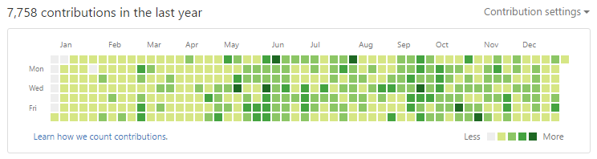
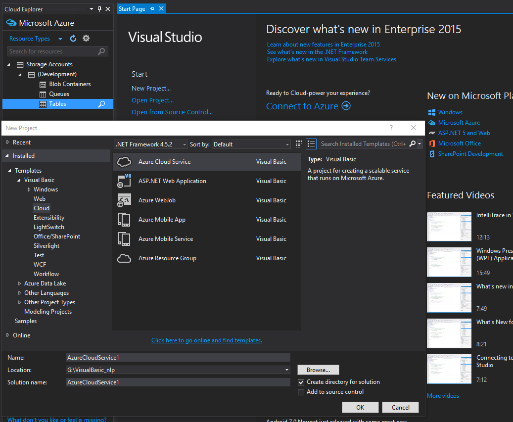
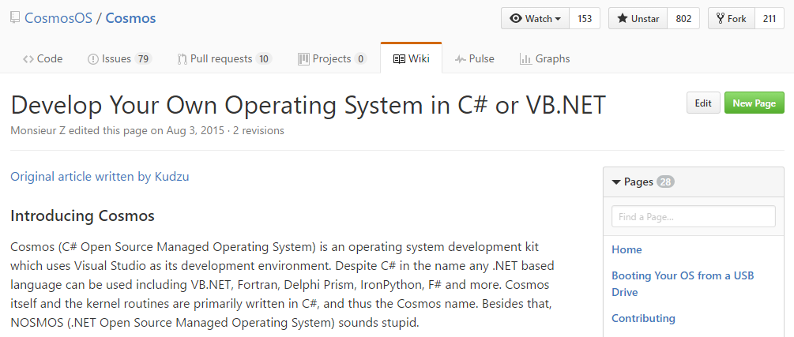
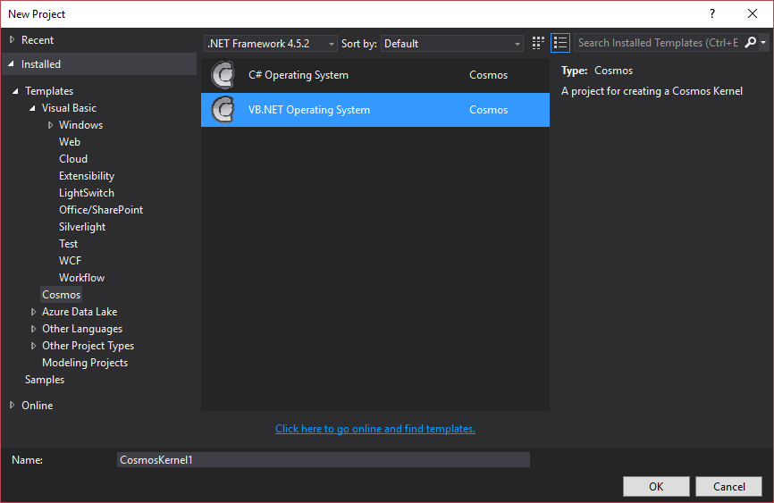
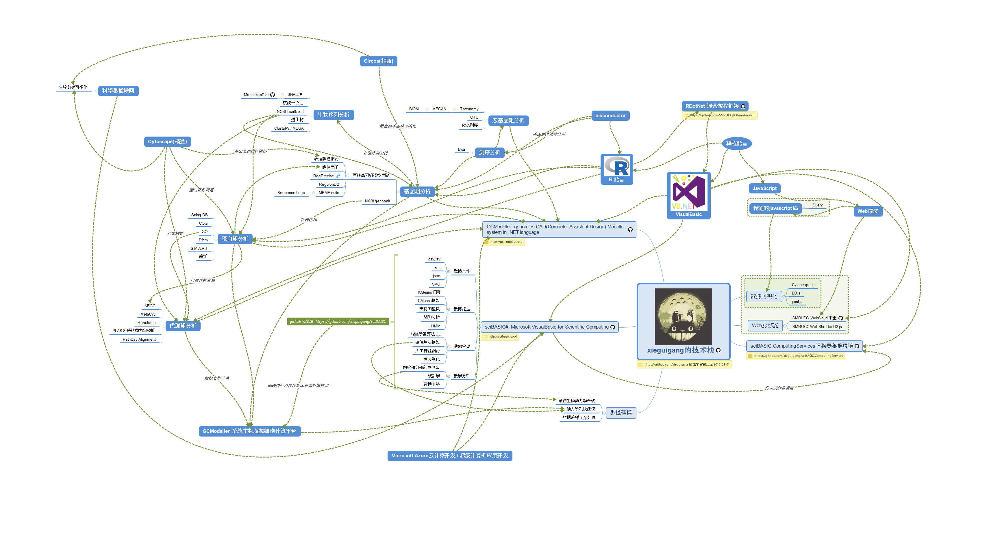
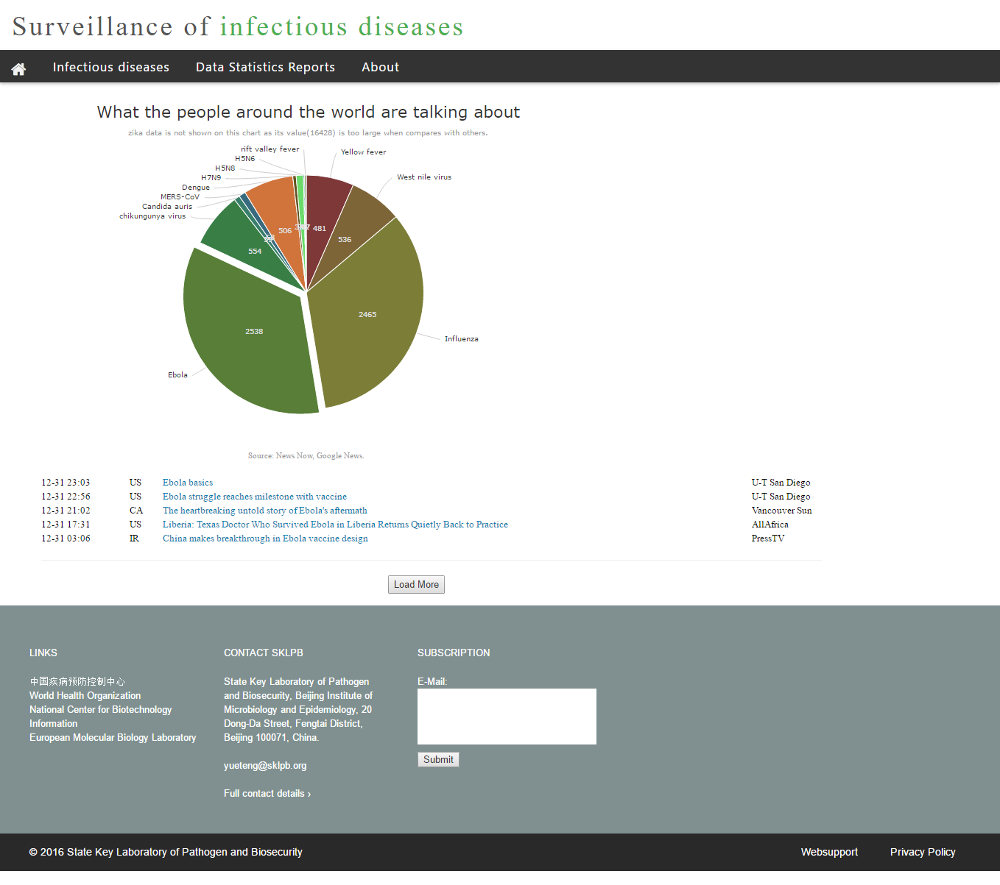
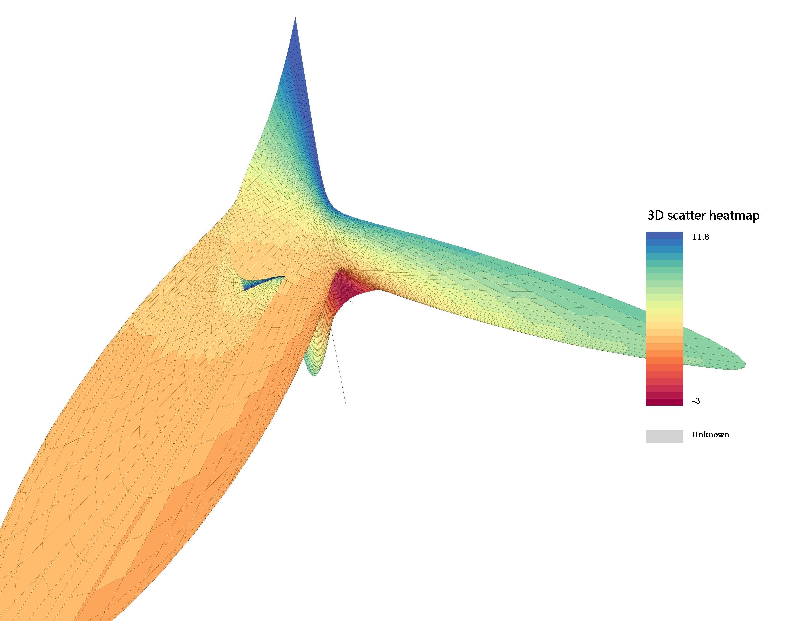
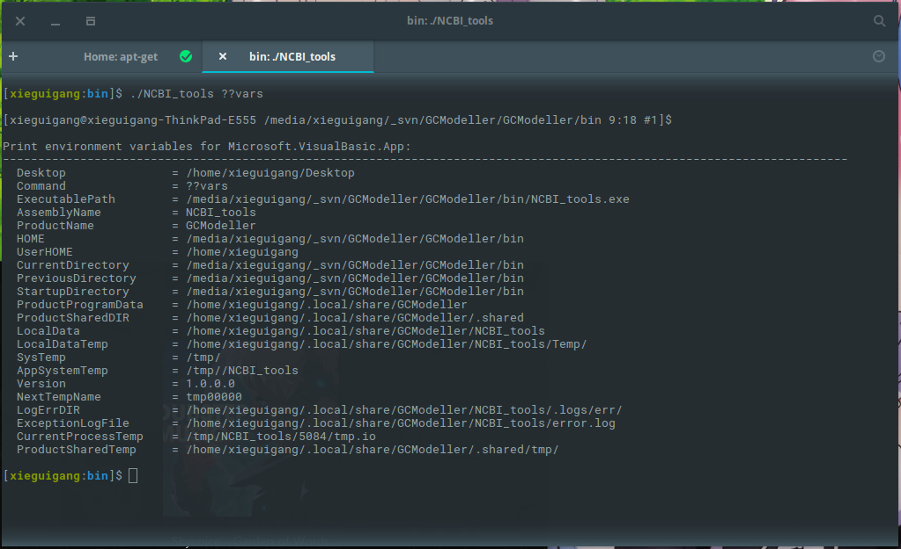
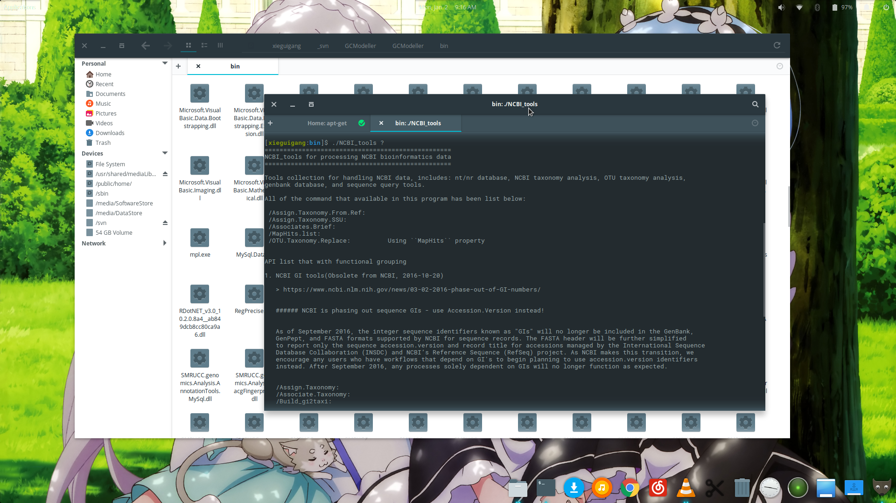
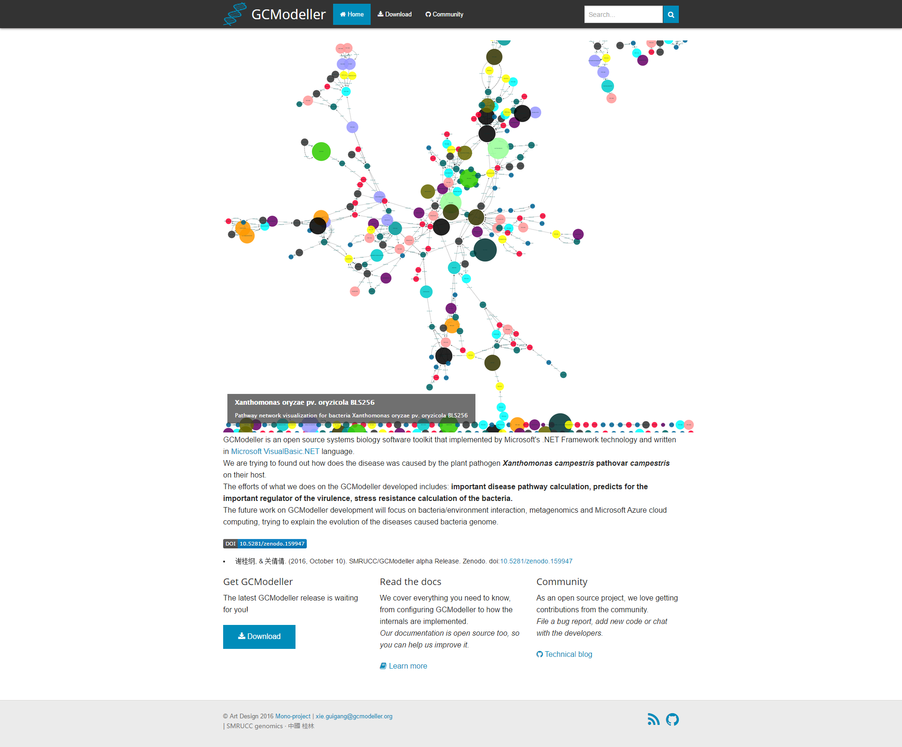

## xieguigang的技术栈

自己在github上面连续的coding也快要满一年了，在新年的最开始，这里对自己在github上面的这一年做一下总结。

虽然自己在2014年就已经注册了github账号，但是从去年(2016年)的一月份开始才开始在github上面写代码，算起来也只是一个github上面的真正算起来才1年经验一个新嫩。每天都在往github上面提交commit，因为想要下决心把contribution里面的所有的方块都要填满去。填坑填了一年的时间，手机上面的小挂件里面的灰格子早就被我给填满了，网页上面的还差一个月才能够被填满。

在使用github之前，自己对于自己的技术走向还不是很明朗，东写一些西写一点，写了很多的junk。自从去年一月份开始下定决心在github上面写够一年的代码，自己花掉了大概一年的时间，终于建立起了属于自己的技术栈。在聊我的技术栈之前，我想先说说我在github上面连续coding的这一年的之间内获得到的最大的收获：

## 心态的变化

都说初生牛犊不怕虎，的确，我在最开始学编程的时候，总是以为自己是最厉害的，心里面会想着怎么能够在一个星期以内完成一个很牛逼的作品。往往是在最开始以很高的热情度先将很容易的部分给干完了，然而随着代码模块数量的增多，整个工程的复杂度也在不断的增加，在以前自己写的每一个作品都差不多是虎头蛇尾类型，往往前面的代码写得比较认真，质量还比较好，但是到了后面啃比较难的骨头的部分的时候，就开始变得混乱不堪，逻辑不清了，草草收尾。

大抵在重度使用github之前，自己使用的是visual svn搭建的本地svn系统做代码的备份。由于仅仅是本地，代码并没有对外界展示，没有什么监督，所以在上github之前，我的代码也是很难看的。或许就是因为这个原因吧，所以才下决心把自己的代码放到github上面，然后假设会有全世界的程序员都可能会阅读到我的代码，监督我写代码，所以这个时候我的心态就变了：写代码开始变得小心翼翼，会时不时的进行代码的重构以保证写的代码是优雅的，所想要表达出来的意思是明了的；有时候也会回过头重新读自己的代码，思考各种对象的命名是否是合适的；有时候也会重读自己的代码，修修改改，在对.NET库的了解更加深入的基础下提升原来的代码的性能。在github上面的这一年的时间，自己也是开始慢慢的脱离了原先的幼稚，慢慢的沉淀自己，这期间的一年的编码经历也是自己的编码技术走向成熟的一个过程。

这里是我总结出来的，在github上面的这一年所经历过的心理变化的两个阶段的状态：

### 第一阶段: do things that doesn't matter - 做一些无关紧要的事情
在经历了最初的两个月的手足无措的状态之后，自己也大抵开始醒悟了，决心认真做一些事情：每天都要写一些代码，即使是无关紧要的对实际项目没有太多帮助，也要继续写下去，保持自己的技能熟练度，因为Rome was not built in a day，也可以是说**不积跬步无以千里**，很牛B的作品也不会在很短的时间内被做出来。由于在那个时候我还没有找到太多的方向，所以在最开始的时候，每天都写写代码，无关任何利益需要，只是因为自己喜欢编程这项娱乐，不必太在乎别人是否需要你的代码或者这个是否是紧跟当前的技术潮流，toy code代码写得再烂也是自己的东西。这一阶段大抵发生在我开始在github上面连续编码的3个月，即3月份开始到5月份结束的这留在校园内的最后三个月时间中。

### 第二阶段: do cool things that matter - 做一些很酷的事情
冰冻三尺非一日之寒，从自己先前的toy code的基础之上，或者说至少自己先通过不断的练习和实践，从toy code这些小怪上面攒下了很多经验，才可能让自己产生蜕变：首先至少应该成为一个优秀的程序员，到后面你才有能力做一些很酷很有意义的事情。这一阶段是从8月份在离家外出工作之前开始的，一直持续到目前现在。实际上从我自己的经历来看，能够撸出一个很厉害的作品，无非是自己能够不断的在自己的前面的toy code这样子的无关大局的工作基础之上穿针引线，把前面写好的一个个的小模块穿插起来，像搭积木一样构建出一座座宏伟大厦。自己在github上面每天写的都是盖大楼的砖块，一边写一边盖大楼，到了最后也就具备有了盖大楼的所有的砖块，大楼成型也就顺理成章了。

都一直在说想要做一些很酷炫的事情，那么先来说说我现在能够做哪些酷炫的事情，自己使用VB除去编写Aspx，Windows应用，hololens AR应用等这类的商业软件开发以外，我觉得还可以做更多的很酷炫的事情上面去，例如VB所原生支持的云计算编程，利用云计算进行数据工业生产，使用VB做动力学系统等等需要非常大的计算量的科研工作，当然也可以用VB从最底层开始写自己的计算机操作系统，然后安装到物理机上面跑，这一类都是能够用VB很好完成的cool things。

> 使用VB做Azure云计算和超算应用开发是一件很爽也很酷的事情

> 使用VB开发编写自己的操作系统也是一件非常酷的事情

## 我的技术栈

在这一年的时间里面，我主要完成了3件我认为是比较酷炫的事情，而这三件酷炫的事也构成了真正的属于我自己的技术栈。我目前的主力的语言是VB和R语言，外加少量的javascript进行数据可视化编程开发，从下面的这张图上面也可以看得出来我自己的技术蓝图主要分为三大部分：

+ 基于Web的数据可视化开发，
+ 科学计算框架技术和
+ 生物信息学数据平台技术。

### 1. Web开发
> [SMRUCC.WebCloud](https://github.com/SMRUCC/SMRUCC.WebCloud): SMRUCC bioinformatics data cloud services platform framework

我的Web开发的技能局限于用javascript进行一些基于SVG的数据可视化开发，可以在技术栈图之中看见Web开发只占据了我的技术栈的右下区域比较小的一部分，大抵也是因为自己的工作之中也对web开发没有太多的需求。在今年8月份的时候，在编写``Surveillance of infectious diseases``网站的时候，自己也根据网站的数据查询需求专门写出了一个差不多的比较轻量级的Web服务器环境，还附加了一些``D3.js``相关的数据源工具。这套自己写的Web服务器程序跑在阿里云上面的一个双核4GB的最低配置的ECS服务器上面，1M小水管，平时访问的时候也挺顺溜的，没有多少卡顿。

为SKLPB实验室的``Surveillance of infectious diseases``网站开发使用的是EMBL css框架，使用白色，黑色以及蓝灰色作为主题，显得比较守旧稳重而又不失时尚，进行数据可视化的颜色效果比较赞。

### 2. 科学计算框架
> [sciBASIC#](https://github.com/xieguigang/sciBASIC): Microsoft VisualBasic for Scientific Computing

在最开始的时候自己想要写出来的是一个适用于VB的一个非常通用的应用程序代码库，但是后来发现以自己的一个人的力量也很难覆盖到软件开发的方方面面，毕竟古人说得好“**术业有专攻**”，在桌面应用，ASPX Web应用，移动应用等商业软件开发并不是我的专长所在。于是在10月份的时候决定专攻数据分析领域的方向，专注于开发命令行应用程序，应为自己所学专业的缘故，所使用的生物数据分析工具都是在linux服务器上面使用的命令行工具。大概在11月份的时候想到了一个很好的名字``sciBASIC#``，Scientific VisualBasic.NET的缩写，取名的灵感来自于python语言里面的scipy包，至于后面加个**``#``**号，是因为.NET语言或者基于.NET开发出来组件库都会喜欢以``sharp``结尾来将自己区别于非微软系的其他语言的代码库。

这里面包括了一个非常不错的基于``csv``文件的数据框架系统，一个非常好的命令行解释器，基于GDI+的包括2维作图以及3维作图的代码库。在北京的时候写的进行论文数据Chartting作图的代码库，一个动力学系统模拟计算的分析框架和一个非常好用的常微分方程组的积分器。这个框架的使用帮助文档大家可以去翻翻这个框架的github page: [https://scibasic.cool/](https://scibasic.cool/)。这一部分的技能占据了整个技术栈的展示图的下半部分。

### 3. 生物大数据云计算平台
> [GCModeller](http://gcmodeller.org): genomics CAD(Computer Assistant Design) Modeller system in .NET language

``GCModeller``工具到目前为止大抵上也是我自己最自豪的项目了，代码全部都是放在github上面免费开源的。GCModeller是使用VB编写的由一组为了不同的生物信息学数据分析目的而构建的命令行程序包，跨所有平台，可以在任何x86/x64平台上面运行，不仅仅包括Windows平台，Linux和macOS上面以及Azure云上面也都能够完美的作为原生的应用工具来运行。因为自己的在大学里面的专业的学习的原因，所以这部分的内容占据了我的技术栈的大半江山，整个图的上半部分都是和GCModeller直接相关的。自己学生物信息学大抵上也是非常幸运的，并不像分子生物之类的需要在实验室里面用昂贵的试剂才能够开展研究，自己买一台服务器在家里面就可以开始自己的数据分析工作了。自己平时的收入也能够让自己过着很体面的生活，也没有太大的经济压力，所以编写GCModeller的目的也并不是为了利用它来赚钱，而只是因为自己喜欢做这样的一件事，为了实现自己内心的想要**do cool things that matter**的理想。

GCModeller平台是基于我自己的``sciBASIC#``框架而开发出来的数据分析套件，在每一个程序里面都应用到了这个框架里面的一个非常优秀的命令行解释器，这个解释器能够根据API的元数据定义自动的排版生成帮助信息，从而GCModeller能够让任何使用者都非常容易的在命令行的环境下面上手，命令行环境中使用GCModeller简易容易上手的这个特性也是和VB的高度易用性相符合的。

在这个GCModeller的技术堆栈里面包含有了5大部分的代码模块，分层次的对应着微生物的细胞系统之中的从开始的基因组分析到最终目标的细胞表型计算的分析，这里面分别包括了：

+ 基因组数据的分析模块，
+ 蛋白质组数据的分析模块，
+ 代谢组数据的分析模块，
+ 之后是由上面的三个模块所整合在一起所构成的虚拟细胞模拟计算分析的动力学系统计算引擎，
+ 最后一大模块就是和宏基因组相关的分析模块了。

使用GCModeller工具也可以非常方便的进行一些生物学数据的作图，画出非常漂亮的论文插图。

#### 最后，新的一年再接再厉

> 谢桂纲 
> 写于2017年1月1日

