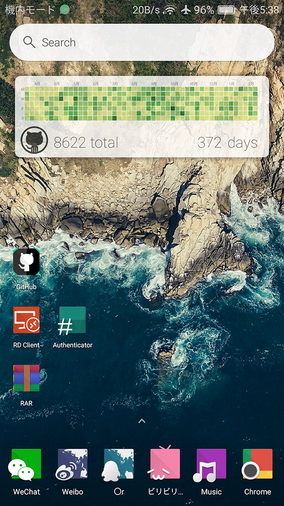

## 我的技術棧

自己在github上面连续的coding也快要满一年了，在这里对自己在github上面的这一年做一下总结

虽然自己在2014年就已经注册了github账号，但是从去年的一月份开始才开始在github上面写代码，算起来也只是一个github上面的真正算起来才1年经验一个新嫩。每天都在往github上面提交commit，因为想要下决心把contribution里面的所有的方块都要填满去。填坑填了一年的时间，手机上面的小挂件早就被我给填满了，网页上面的还差一个月才能够被填满。

自己花掉了大概一年的时间，建立起了自己的技术栈，

## 第一步: do cool things that doesn't matter - 做一些无关紧要的事情
都说初生牛犊不怕虎，事实上我在最开始学编程的时候也是想着怎么能够。最开始每天都要做一些无关紧要的事情，因为Rome was not built in a day.
所以在最开始的时候，每天都写写代码，无关任何利益需要，只是因为自己喜欢编程这项娱乐，不必太在乎别人是否需要你的代码或者这个是否是紧跟当前的技术潮流，toy code代码写得再烂也是自己的东西。

## 第二步: do cool things that matter - 做一些很酷的事情
冰冻三尺非一日之寒，从自己先前的toy code的基础之上，或者说至少自己先通过不断的练习和实践，首先成为一个优秀的程序员，到后面你才有能力做一些很酷很有意义的事情。

> 使用VB做Azure云计算和超算应用开发是一件很爽也很酷的事情

> 使用VB开发编写自己的操作系统也是一件非常酷的事情

## 我的技术栈

### 1. Web开发
> [SMRUCC.WebCloud](https://github.com/SMRUCC/SMRUCC.WebCloud): SMRUCC bioinformatics data cloud services platform framework

我的Web开发的技能局限于用javascript进行一些基于SVG的数据可视化开发，可以在技术栈图之中看见Web开发只占据了我的技术栈的右下区域比较小的一部分，大抵也是因为自己的工作之中也对web开发没有太多的需求。在今年8月份的时候，在编写``Surveillance of infectious diseases``网站的时候，自己也根据网站的数据查询需求专门写出了一个差不多的比较轻量级的Web服务器环境，还附加了一些``D3.js``相关的数据源工具。这套自己写的Web服务器程序跑在阿里云上面的一个双核4GB的最低配置的ECS服务器上面，1M小水管，平时访问的时候也挺顺溜的，没有多少卡顿。

为SKLPB实验室的``Surveillance of infectious diseases``网站开发使用的是EMBL css框架，使用白色，黑色以及蓝灰色作为主题，显得比较守旧稳重而又不失时尚，进行数据可视化的颜色效果比较赞。

### 2. 计算框架
> [sciBASIC#](https://github.com/xieguigang/sciBASIC): Microsoft VisualBasic for Scientific Computing

在最开始的时候自己想要写出来的是一个适用于VB的一个非常通用的应用程序代码库，但是后来发现以自己的一个人的力量也很难覆盖到软件开发的方方面面，毕竟古人说得好“**术业有专攻**”，在桌面应用，ASPX Web应用，移动应用等商业软件开发并不是我的专长所在。于是在10月份的时候决定专攻数据分析领域的方向，大概在11月份的时候想到了一个很好的名字``sciBASIC#``，Scientific VisualBasic.NET的缩写，取名的灵感来自于python语言里面的scipy包，至于后面加个**``#``**号，是因为.NET语言或者基于.NET开发出来组件库都会喜欢以``sharp``结尾来将自己区别于非微软系的其他语言的代码库。

这里面包括了一个非常不错的基于``csv``文件的数据框架系统，一个非常好的命令行解释器，基于GDI+的包括2维作图以及3维作图的代码库。在北京的时候写的进行论文数据Chartting作图的代码库，一个动力学系统模拟计算的分析框架和一个非常好用的常微分方程组的积分器。

### 3. 生物大数据云计算平台
> [GCModeller](http://gcmodeller.org): genomics CAD(Computer Assistant Design) Modeller system in .NET language

``GCModeller``工具到目前为止大抵上也是我自己最自豪的项目了

> 谢桂纲 
> 写于2017年1月1日

